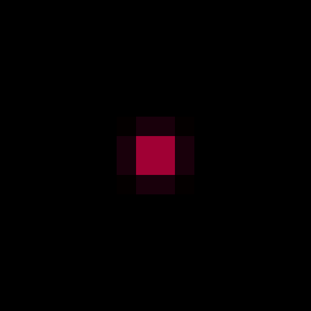
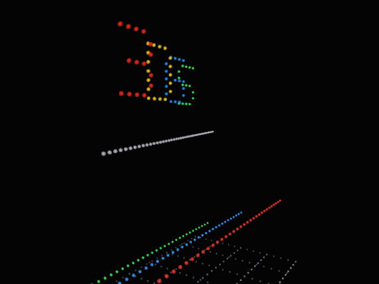
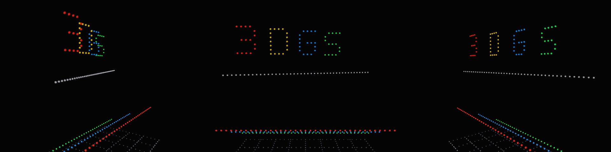
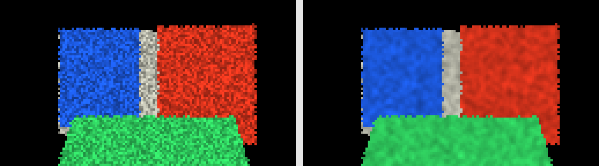
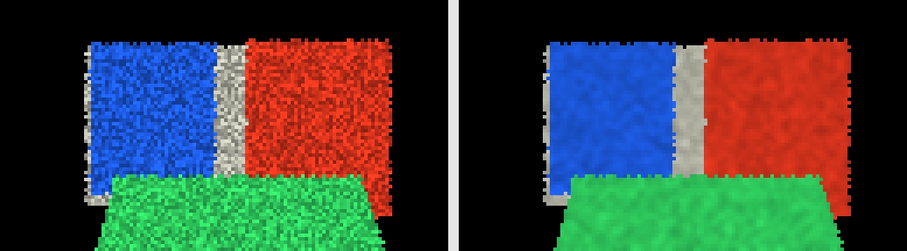
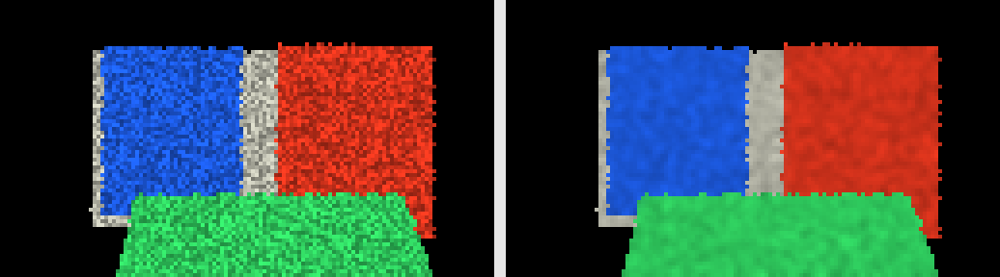
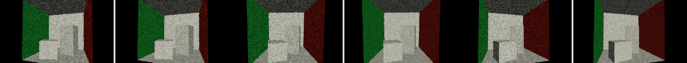

# vkGSplat Test Report

This report describes the current CTest suite, what each test validates, and which tests produce visual output. Most tests are validation-only executables: they return success/failure and do not write files. 3DGS is paused in the default build; the 3DGS artifacts and tests below are optional and require `-DVKGSPLAT_ENABLE_3DGS=ON`.

## Optional CPU 3DGS Image



The image is a 16x16 CPU reference render scaled to 512x512 for inspection. It contains two overlapping synthetic Gaussians: a far blue splat and a nearer red splat. The expected center pixel is red-dominant after depth-sorted blending, while the image corners remain black background.

Regenerate it with:

```sh
cmake -S . -B build-cpu-3dgs -DVKGSPLAT_ENABLE_VULKAN=OFF -DVKGSPLAT_ENABLE_CUDA=OFF -DVKGSPLAT_ENABLE_3DGS=ON -DCMAKE_BUILD_TYPE=Release
cmake --build build-cpu-3dgs
c++ -std=c++20 -Iinclude scripts/render_cpu_test_image.cpp build-cpu-3dgs/libvkgsplat.a -o build-cpu-3dgs/render_cpu_test_image
build-cpu-3dgs/render_cpu_test_image docs/images/cpu_3dgs_render.ppm
magick docs/images/cpu_3dgs_render.ppm -filter point -resize 512x512 docs/images/cpu_3dgs_render.png
```

## Optional CPU 3DGS Camera Clip



This clip uses the CPU 3DGS renderer, not the ray-tracing seed fixture. The camera orbits a dense point-splat calibration target made from many small Gaussians, so the `3DGS` letters and guide grid move with visible parallax while the renderer exercises Gaussian projection, tile binning, depth sorting, and alpha blending.

Representative stills:



Regenerate it with:

```sh
c++ -std=c++20 -Iinclude scripts/render_3dgs_camera_clip.cpp build-cpu-3dgs/libvkgsplat.a -o build-cpu-3dgs/render_3dgs_camera_clip
build-cpu-3dgs/render_3dgs_camera_clip docs/images/cpu_3dgs_camera_clip
ffmpeg -y -framerate 12 -i docs/images/cpu_3dgs_camera_clip_%03d.ppm -pix_fmt yuv420p docs/images/cpu_3dgs_camera_clip.mp4
magick -delay 8 -loop 0 docs/images/cpu_3dgs_camera_clip_*.ppm -layers Optimize docs/images/cpu_3dgs_camera_clip.gif
magick docs/images/cpu_3dgs_camera_clip_000.png docs/images/cpu_3dgs_camera_clip_018.png docs/images/cpu_3dgs_camera_clip_035.png +append docs/images/cpu_3dgs_camera_clip_stills.png
```

## Generated Ray Tracing Seed Clip


This clip is generated from the M6 ray-tracing seed fixture, not from 3DGS. Each frame is a side-by-side panel: the left half is the noisy 1-spp CPU seed frame, and the right half is the M4/M5 output after camera-derived temporal reprojection and SVGF-style denoising.

Representative stills:





Regenerate it with:

```sh
c++ -std=c++20 -Iinclude scripts/render_raytrace_seed_clip.cpp build-cpu/libvkgsplat.a -o build-cpu/render_raytrace_seed_clip
build-cpu/render_raytrace_seed_clip docs/images/raytrace_seed_clip
ffmpeg -y -framerate 10 -i docs/images/raytrace_seed_clip_%03d.ppm -vf scale=1036:288:flags=neighbor -pix_fmt yuv420p docs/images/raytrace_seed_clip.mp4
magick -delay 10 -loop 0 docs/images/raytrace_seed_clip_*.ppm -filter point -resize 400% -layers Optimize docs/images/raytrace_seed_clip.gif
```

## Generated Wicked Cornell CPU And Metal Clips

CPU denoise path:


M4 Metal denoise path:


These clips use Wicked Engine's `cornellbox.obj` geometry and material colors,
but they are not native Wicked Vulkan ray-tracing images. The local Wicked
Vulkan run on MoltenVK reports `capability.raytracing=no`, so the generator
loads the same OBJ/MTL asset, triangulates the quads, normalizes it into the
vkGSplat CPU ray-tracing seed scene, and feeds the frames through camera-motion
reprojection plus SVGF-style denoising. The CPU clip runs denoise on the CPU;
the Metal clip runs the denoise stage on the M4 GPU. Each frame is a
side-by-side panel: noisy seed frame on the left, denoised reconstruction on
the right. The orbit spans a much wider angle than the first Cornell clip so
camera motion and temporal reprojection are easier to inspect.

Representative CPU stills:


Representative Metal stills:



Regenerate them with:

```sh
cmake --build build-cpu --parallel 8
cmake --build build-metal --parallel 8
c++ -std=c++20 -Iinclude scripts/render_wicked_cornell_seed_clip.cpp build-cpu/libvkgsplat.a -o build-cpu/render_wicked_cornell_seed_clip
c++ -std=c++20 -DVKGSPLAT_ENABLE_METAL=1 -Iinclude scripts/render_wicked_cornell_seed_clip.cpp build-metal/libvkgsplat.a -framework Metal -framework Foundation -o build-metal/render_wicked_cornell_seed_clip
build-cpu/render_wicked_cornell_seed_clip docs/images/wicked_cornell_seed_clip_cpu third_party/WickedEngine/Content/models/cornellbox.obj cpu
build-metal/render_wicked_cornell_seed_clip docs/images/wicked_cornell_seed_clip_metal third_party/WickedEngine/Content/models/cornellbox.obj metal
magick docs/images/wicked_cornell_seed_clip_cpu_000.ppm -filter point -resize 300% docs/images/wicked_cornell_seed_clip_cpu_000.png
magick docs/images/wicked_cornell_seed_clip_cpu_017.ppm -filter point -resize 300% docs/images/wicked_cornell_seed_clip_cpu_017.png
magick docs/images/wicked_cornell_seed_clip_cpu_035.ppm -filter point -resize 300% docs/images/wicked_cornell_seed_clip_cpu_035.png
magick docs/images/wicked_cornell_seed_clip_metal_000.ppm -filter point -resize 300% docs/images/wicked_cornell_seed_clip_metal_000.png
magick docs/images/wicked_cornell_seed_clip_metal_017.ppm -filter point -resize 300% docs/images/wicked_cornell_seed_clip_metal_017.png
magick docs/images/wicked_cornell_seed_clip_metal_035.ppm -filter point -resize 300% docs/images/wicked_cornell_seed_clip_metal_035.png
magick docs/images/wicked_cornell_seed_clip_cpu_000.png docs/images/wicked_cornell_seed_clip_cpu_017.png docs/images/wicked_cornell_seed_clip_cpu_035.png +append docs/images/wicked_cornell_seed_clip_cpu_stills.png
magick docs/images/wicked_cornell_seed_clip_metal_000.png docs/images/wicked_cornell_seed_clip_metal_017.png docs/images/wicked_cornell_seed_clip_metal_035.png +append docs/images/wicked_cornell_seed_clip_metal_stills.png
ffmpeg -y -loglevel error -framerate 12 -i docs/images/wicked_cornell_seed_clip_cpu_%03d.ppm -vf scale=1548:432:flags=neighbor -pix_fmt yuv420p docs/images/wicked_cornell_seed_clip_cpu.mp4
ffmpeg -y -loglevel error -framerate 12 -i docs/images/wicked_cornell_seed_clip_metal_%03d.ppm -vf scale=1548:432:flags=neighbor -pix_fmt yuv420p docs/images/wicked_cornell_seed_clip_metal.mp4
magick -delay 8 -loop 0 docs/images/wicked_cornell_seed_clip_cpu_*.ppm -filter point -resize 300% -layers Optimize docs/images/wicked_cornell_seed_clip_cpu.gif
magick -delay 8 -loop 0 docs/images/wicked_cornell_seed_clip_metal_*.ppm -filter point -resize 300% -layers Optimize docs/images/wicked_cornell_seed_clip_metal.gif
```

## CPU Test Suite

| Test | What it checks | Image output |
| --- | --- | --- |
| `test_camera` | Builds a camera, sets resolution and perspective, applies `look_at`, and verifies the dimensions/FOV plus a nonzero view matrix. | None |
| `test_denoise` | Runs the SVGF-style M5 denoising baseline. It verifies temporal accumulation from reprojected history, noisy-pixel smoothing, luminance variance tracking, and edge-aware rejection across depth/primitive discontinuities. | In-memory only. |
| `test_public_headers` | Includes the umbrella `vkgsplat/vkgsplat.h` in a CPU-only build and checks basic `Scene`, `Camera`, and tile-grid APIs remain usable without Vulkan/CUDA SDK headers. | None |
| `test_raytrace_seed` | Runs the M6 Vulkan-ray-tracing-shaped CPU seed fixture. It traces two noisy 1-spp triangle-scene frames, verifies hit/miss behavior and RT API-shape flags, derives a camera motion map from NDC depth and camera matrices, reprojects stable hit history, rejects miss history, and feeds the result into the denoiser. | In-memory only. |
| `test_reprojection` | Runs the two-frame temporal reprojection contract. It derives a current-to-previous screen-space motion map from camera matrices and current NDC depth, reprojects previous-frame color, and checks history rejection for disocclusion, primitive-ID mismatch, and depth mismatch. | In-memory only. |
| `test_scene` | Smoke-tests the `Scene` container: empty state, resize, size, and name storage. | None |
| `test_sensor_model` | Checks calibrated sensor measurement helpers used by the Physical AI acquisition/reconstruction split. | None |
| `test_spirv_translate` | Exercises the SPIR-V parser/analyzer and restricted C/CUDA translators. It covers entry points, storage buffers, descriptor decorations, `GlobalInvocationId`, ray query ops, and `RayGenerationKHR`/`OpTraceRayKHR` lowering. | None |
| `test_tile_raster` | Checks tile-grid construction and deterministic half-open tile binning for splat bounds that are inside, clipped, crossing tiles, and outside. | None |
| `test_types` | Guards core POD layout: `float3`, `float4`, `mat4`, and the Gaussian SH coefficient count. | None |

## Optional Native GPU Tests

These tests compile when the relevant native backend is enabled. On Apple,
`VKGSPLAT_ENABLE_METAL` defaults to `ON`. In sandboxed runners, Metal device
discovery can be hidden; the test returns skip code `77` if no device is visible.

| Test | What it checks | Image output |
| --- | --- | --- |
| `test_metal_denoise` | Runs the M5 SVGF-style denoise contract on the native Apple GPU through Metal. It compares temporal accumulation, spatial filtering, variance, and history flags against the CPU reference. | None |

## Optional 3DGS Tests

These tests compile only when `VKGSPLAT_ENABLE_3DGS=ON`.

| Test | What it checks | Image output |
| --- | --- | --- |
| `test_cpp_backend` | Verifies the optional C++ 3DGS renderer factory, host-buffer render target path, and RGBA8 pixel writes. | None |
| `test_cpu_3dgs_render` | Runs the CPU 3DGS reference path end to end: projection, tile binning, depth order, and alpha blending for two overlapping splats. It also checks an anisotropic splat projects wider on X than Y. | In-memory only; reproduced above by `scripts/render_cpu_test_image.cpp`. |
| `test_gpu_pipeline` | Verifies shared 3DGS GPU ABI structs are trivially copyable and have expected sizes for CPU/Vulkan/CUDA handoff. | None |
| `test_real_asset_path` | Writes a tiny binary little-endian 3DGS PLY fixture, loads it through `Scene::load`, renders it through the CPU reference renderer, and checks projected count, image energy, and touched tiles. | In-memory only. |
| `test_scene_io` | Writes a minimal `.splat` fixture and verifies decoding of position, log-scale, color-to-SH DC, opacity logit, and quaternion rotation. | None |
| `test_scene_ply` | Writes a binary little-endian 3DGS PLY with Kerbl/Lyra-style properties and verifies position, SH coefficients, opacity, scale, rotation, and selected higher-order SH channels. | None |

## Optional Hardware Tests

These tests are compiled only when the relevant SDK/backend is enabled. They return CTest skip code `77` when required hardware or features are unavailable.

| Test | What it checks | Image output |
| --- | --- | --- |
| `test_vulkan_m7_offscreen` | Creates a Vulkan instance, finds a physical device with vkGSplat mesh-shader requirements, finds a graphics queue, and creates a logical device with mesh shader, buffer device address, and synchronization extensions. The offscreen draw target is still a gate, not a rendered image test. | None |
| `test_cuda_tile_renderer` | With CUDA and 3DGS enabled, runs the CUDA tile renderer on a tiny projected-splat fixture, copies pixels back, and checks the center pixel is red-dominant after sorted blending. | In-memory only. |
| `test_cuda_rasterizer_smoke` | With CUDA and 3DGS enabled, exercises the public CUDA renderer path: `make_renderer("cuda")`, scene upload, CUDA preprocess/projection, fixed-capacity deterministic device tile lists/ranges, tile blending, `HOST_BUFFER` readback, and `INTEROP_IMAGE` CUDA-surface output. | In-memory only. |
| `test_cuda_gaussian_reconstruction` | With CUDA and 3DGS enabled, validates the tensorized reconstruction kernels for seed-buffer ingestion, device-side sample counts, tile bin/compact/resolve, gated weighted resolve, Gaussian state update, and feature projection. | In-memory only. |

## Latest Local Result

The CPU suite passed locally:

```text
Default Apple build, VKGSPLAT_ENABLE_3DGS=OFF, VKGSPLAT_ENABLE_METAL=ON:
100% tests passed, 0 tests failed out of 11

CUDA configure on this Mac:
blocked before compile because CMake cannot find nvcc. Re-run the CUDA gates on
an NVIDIA workstation with CUDA Toolkit 12.8+.
```
